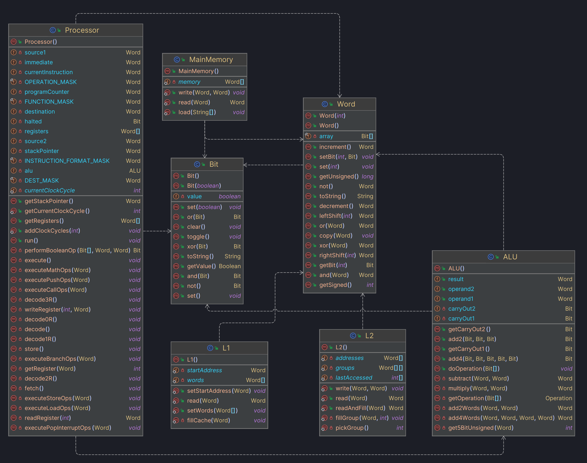

# Processor
This project replicates a 32-bit processor in Java based entirely on two core classes: Bit and Word. The processor uses a custom assembly language SIA32, for which an interpreter is provided. Some sample programs are available.

The processor has two basic caches. There is a level 1 instruction cache and a level 2 cache that holds both instructions and data. After a program runs, the total number of clock cycles is printed to the console.

This project was created as part of the Computer Architecture and Organization class ICSI 404 Spring 2024.
## Use
1. Clone the repository and build the project.
2. Write an assembly program.
3. Run the main class, passing the path to your assembly file as an argument.
4. Watch it run!

## UML
Note: Classes related to unit testing, lexing, parsing, and interpreting have been removed for brevity.
